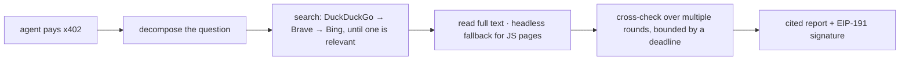

# Reach

**Research with sources you can check.**

Ask a question. Reach searches the live web, opens the pages, and returns an answer where every claim
points at a source it actually fetched during that run — signed, so anyone can confirm it came from Reach
and was not altered.


-black)


**Live:** [reach.ivaronix.xyz](https://reach.ivaronix.xyz) · **Proof — real outputs and on-chain
settlement hashes:** [/proof](https://reach.ivaronix.xyz/proof) · **OKX.AI:** agent #9178
· **Product page:** [Notion](https://comfortable-goal-205.notion.site/Reach-3a99c0ce7876815b9274f3e1856e24d7) · **All three:** [Hub](https://comfortable-goal-205.notion.site/OKX-AI-Genesis-Hackathon-Aletheia-Reach-Episteme-3a99c0ce78768104958be46465e840dd)

---

## The problem

The expensive part of AI research is not getting an answer. It is checking one.

A model returns something fluent and mostly right. Somewhere inside are two claims it invented and one it
half-remembered from a source that said the opposite. You cannot tell which by reading — that is precisely
the failure mode — so you verify it yourself, and the verification costs more than the research saved.

Citations were supposed to fix this and mostly have not, because a model can produce a citation the same
way it produces everything else: by predicting what one looks like. A URL in an answer is not evidence
that the URL was read.

## The idea

**Prove the sourcing, since you cannot prove the answer.**

Open-web research can never be reproducible — the web moves underneath you. So Reach proves the next best
thing: every cited URL is a page it actually fetched during that run, and the full list of sources it
touched sits alongside the subset it cited, so you can see what it read and chose not to use.

The second half of the idea is harder, and more useful: **the service scores its own results and admits
when they are wrong.**

Ask for *"X Layer OKX rollup architecture"* and one major engine returns six links about Twitter — it
fixates on the leading token "X" and never recovers. The obvious behaviour is to hand back those six links
with `ok: true` and a result count of six. Confidently, cheerfully wrong — and an agent downstream will
cite all of them.

Instead, every result set is scored against the query's discriminating terms. Below threshold the next
engine is tried; if none clears it, the answer comes back marked `degraded` with its relevance score. A
confident false positive is worse for an agent than an honest empty answer, because it propagates.

## Try it

```bash
# Unpaid call → 402 with the challenge in the PAYMENT-REQUIRED header
curl -i -X POST https://reach.ivaronix.xyz/search \
  -H 'Content-Type: application/json' -d '{}'

# Sign the challenge (EIP-3009, USD₮0 on X Layer) and replay it
curl -X POST https://reach.ivaronix.xyz/search \
  -H 'PAYMENT-SIGNATURE: <signed authorization>' \
  -H 'Content-Type: application/json' \
  -d '{"query":"X Layer OKX rollup architecture","num":6}'
```

An **empty body on a paid endpoint returns that endpoint's input contract** with a worked example rather
than an error — you have already been charged by the time the handler runs, so you get something useful.

## What comes back

```jsonc
{
  "ok": true,
  "query": "X Layer OKX rollup architecture",
  "result_count": 6,
  "relevance": 1.0,        // fraction of the query's discriminating terms actually matched
  "degraded": false,       // true → these results may not be about your subject
  "sources": [
    { "n": 1, "url": "https://web3.okx.com/onchainos/dev-docs/xlayer/…", "title": "X Layer Developer Docs" }
  ]
}
```

A research report adds the written answer, the cited subset, the model that actually served the run, and
an EIP-191 signature over a digest of the whole payload. Untrimmed examples for every service are on the
[proof page](https://reach.ivaronix.xyz/proof).

## Services

Three listed on OKX.AI, plus one A2A service for research negotiated over XMTP.

| Endpoint | What it does | Price |
| --- | --- | ---: |
| `/research` | Autonomous multi-round investigation → cited report, full source list, signed | $0.05 |
| `/read` | Fetch one URL and return clean readable text, JavaScript-rendered pages included | $0.01 |
| `/search` | Live open-web search → ranked results plus the relevance score for the set | $0.01 |

`POST /research/stream` runs the identical research as `/research` and returns it as Server-Sent
Events — the tool calls live, then the report — at the same $0.05. It is the same service in a
different transport rather than a fourth listing, so it is not counted as one.

Verification at `/receipt/verify` is free.

## How it is built



A Node gateway running OKX's x402 seller SDK proxies to a Python FastAPI engine. Four decisions worth
calling out:

- **Engines are a chain, not a choice.** DuckDuckGo when reachable, then Brave, then Bing — an order that
  was measured, not assumed. Engines fail differently and unpredictably; depending on one is how a
  research product silently gets worse.
- **Models are a chain too.** The reasoning loop walks an ordered list across two API dialects — Anthropic
  `/v1/messages` and OpenAI `/v1/chat/completions` — adapting at the edge so the loop keeps a single
  internal representation. The report names the model that actually wrote it, because crediting one that
  never ran is a false provenance claim.
- **A paid call never runs past its window.** Gathering stops at a deadline and the model writes with what
  it has. Overrunning the x402 window means the buyer paid and received a gateway error.
- **Reasoning never reaches the caller.** Models that emit a scratchpad inline, or spend the whole token
  budget thinking and return nothing, are stripped and retried. You paid for a report, not an inner
  monologue.

Deep research runs off the event loop in a thread pool, so one long call never blocks another — measured,
the paywall answers in about 0.18 s while a multi-minute research run is in flight.

## Safety

SSRF-guarded fetching blocks loopback, private ranges and cloud metadata endpoints; response sizes are
capped server-side; payment is fail-closed — the gateway refuses to start rather than serve paid routes
for free.

## Verify a report yourself

```bash
curl https://reach.ivaronix.xyz/.well-known/reach-signer     # the published signing address

curl -X POST https://reach.ivaronix.xyz/receipt/verify \
  -H 'Content-Type: application/json' -d '{ …the signed report… }'
```

Recover the signer from `signed.signature` over `signed.message_sha256` and require it to equal the
published address. A report recovering to anything else was not issued by Reach.

## What it does not do

- **Quality is bounded by what the open web exposes.** Engines rate-limit and pages block readers. When
  results are weak the response says so instead of hiding it.
- **TEE attestation is not claimed unconditionally.** The `tee_verified` flag is true only when the 0G
  provider actually returns a verified attestation, which on the standard router is often false.
- **This is autonomous research, not advice.** Every claim cites a source; check the ones that matter.

## Development

```bash
pip install -r requirements.txt
python -m scrapling install     # stealth/JS browser, once
python -m pytest tests/ -q      # model-chain and adapter tests
python server.py                # the research engine

cd gateway && npm install && npm start   # x402 gateway (REACH_DEV_OPEN=1 for local, never in prod)
```

Requires `ZG_COMPUTE_API_KEY` for inference; `REACH_SIGNER_KEY` enables signing.

Built on tool-selection patterns from **agent-reach** (MIT) and **Scrapling** (BSD-3) for fetching — see
`THIRD_PARTY_LICENSES.md`.

MIT licensed. Autonomous research aid — verify the caveats yourself. Not financial advice.
